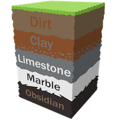
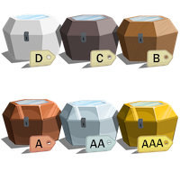

# CryptoMiner World
ERC721 based decentralized game by [Sophophilia Studios](https://sophophilia.com/)

## Abstract
Lunched in late 2017, [Awesome CryptoKitties](https://github.com/cryptocopycats/awesome-cryptokitties)
opened a new era of [ERC721](http://erc721.org/) based decentralized games.
Being a pioneer, they didn't have to make their decentralized
game architecture perfect, they have left this issue to their followers.

[CryptoMiner World](https://cryptominerworld.com/) is one of these followers.
We've raised questions and problems left by our predecessors and designed the solutions to address these issues:
* Immutability vs upgradability in ERC721 based decentralized games
* Flexible and powerful access control
* Gas cost optimizations, transaction load reduction by leveraging off-chain capabilities

## Game Overview
_"Dig down, Level up, Trade in, Cash out"_

A step-by-step walkthrough of CryptoMiner World:

### The Basics

#### Buy a Plot of Land
Pick any location on the Earth to call your own.  


#### Select a Gemstone
One of your Gems can be assigned to each land plot you own.  


#### Sit Back and Relax
Gemstones love the earth so much, they eat it up.
Your assigned Gems will automatically dig through plots of land while you're away.  


#### Collect Your Loot
As time passes, your Gems will dig deeper and deeper, uncovering more and more treasure for you.    
Check up on them every day, week, month or whenever's convenient to see what's been found.  


#### Sell Your Loot
If you find something exciting, the best place to sell it is at the market.
Trade your valuables for Ether or just stop by to see what other people have dug up.  


### Digging Deeper
#### Layers of Land
Each plot of land is made up of 5 different tiers of terrain.
While every tier has the possibility to hold great treasure, the deeper you go, the more the possibilities increase.  


#### Growing Up
Baby Gems have a hard time eating anything but dirt.
As you level up their age, they’ll be able to handle the harder stuff.
Want to dig through obsidian? Get a Gem to a full grown adult and they’ll be able to handle anything.  
_Silver_ ore is used to increase your Gem's age. Find it while digging or from other players in the market.  


#### Speed King
Every Gem is born with a random grade. Higher grades can mine much faster.  
_Gold_ ore is used to increase your Gem's grade. Find it while digging or from other players in the market.  


### The Good Stuff
#### The Bottom
You did it, you made it through an entire plot of land. You should be rewarded for your efforts.
Collect your bonus loot. Maybe you’ll discover another gemstone, or a special artifact that grants additional powers,
or even a real life physical prize that can be mailed out to your actual home address. So many possibilities!  
If you’re really lucky, you might even find a rare key.  


#### Are You the Keymaster?
Keys are special in the world of CryptoMiner. Each one has the possibility to open a Monthly Chest or even the World Chest.  


#### Gemstone Chests
20% of all Plot of Land sales will go back to the players in the form of Gemstone Chests.
Along with Land sales, 1% of everything sold on the Market will go into the Gemstone Chests as well.
Once 10 ETH is accumulated a Gemstone Chest is released and a Key can open it.  


#### The Magical, Once in a Lifetime, Super Special, Ether World Chest
The title needs work, but there’s so much Ether in this chest, it deserves being so long.
Let's go with, World Chest. Once all Plots of Land have been purchased, this World Chest will be opened by one lucky Key holder.  


## Architecture Overview
// TODO

## Compile, Test, Deploy and Run
The project was developed and tested on Mac OSX 10.14.6

### Prerequisites
1. [Git](https://git-scm.com/) to download the source code
2. [Node.js](https://nodejs.org/) and [npm](https://www.npmjs.com/get-npm) to run truffle (see below)
3. [Truffle](https://www.trufflesuite.com/truffle) to compile and deploy smart contracts into test and main networks
4. [Ganache](https://www.trufflesuite.com/ganache) to run smart contract tests locally

### Compile
1. Get the source code:  
```git clone git@github.com:vgorin/crypto-miner.git```  

2. Install project dependencies  
```npm install```

3. Create an empty ```keys.js``` file:  
```touch keys.js```

4. Compile:  
```truffle compile```

### Test

1. Make sure to complete items 1–3 from previous section if you did not do it already

2. Run tests  
```./test.sh```


### Examples:
#### Getting the Code
```
BBOOK-PRO:tmp vgorin$ git clone git@github.com:vgorin/crypto-miner.git
Cloning into 'crypto-miner'...
Enter passphrase for key '/Users/vgorin/.ssh/id_rsa':
remote: Enumerating objects: 728, done.
remote: Counting objects: 100% (728/728), done.
remote: Compressing objects: 100% (342/342), done.
remote: Total 6189 (delta 533), reused 556 (delta 386), pack-reused 5461
Receiving objects: 100% (6189/6189), 20.82 MiB | 6.92 MiB/s, done.
Resolving deltas: 100% (4643/4643), done.
```
#### Installing Dependencies
```
BBOOK-PRO:tmp vgorin$ cd crypto-miner/
BBOOK-PRO:crypto-miner vgorin$ npm install

> scrypt@6.0.3 preinstall /private/tmp/crypto-miner/node_modules/scrypt
> node node-scrypt-preinstall.js


> scrypt@6.0.3 install /private/tmp/crypto-miner/node_modules/scrypt
> node-gyp rebuild

  SOLINK_MODULE(target) Release/copied_files.node
  CC(target) Release/obj.target/scrypt_wrapper/src/util/memlimit.o
  CC(target) Release/obj.target/scrypt_wrapper/src/scryptwrapper/keyderivation.o
  CC(target) Release/obj.target/scrypt_wrapper/src/scryptwrapper/pickparams.o
  CC(target) Release/obj.target/scrypt_wrapper/src/scryptwrapper/hash.o
  LIBTOOL-STATIC Release/scrypt_wrapper.a
  CC(target) Release/obj.target/scrypt_lib/scrypt/scrypt-1.2.0/lib/crypto/crypto_scrypt.o
  CC(target) Release/obj.target/scrypt_lib/scrypt/scrypt-1.2.0/lib/crypto/crypto_scrypt_smix.o
  CC(target) Release/obj.target/scrypt_lib/scrypt/scrypt-1.2.0/libcperciva/util/warnp.o
  CC(target) Release/obj.target/scrypt_lib/scrypt/scrypt-1.2.0/libcperciva/alg/sha256.o
  CC(target) Release/obj.target/scrypt_lib/scrypt/scrypt-1.2.0/libcperciva/util/insecure_memzero.o
  CC(target) Release/obj.target/scrypt_lib/scrypt/scrypt-1.2.0/lib/scryptenc/scryptenc_cpuperf.o
  LIBTOOL-STATIC Release/scrypt_lib.a
  CXX(target) Release/obj.target/scrypt/src/node-boilerplate/scrypt_common.o
  CXX(target) Release/obj.target/scrypt/src/node-boilerplate/scrypt_params_async.o
  CXX(target) Release/obj.target/scrypt/src/node-boilerplate/scrypt_params_sync.o
  CXX(target) Release/obj.target/scrypt/src/node-boilerplate/scrypt_kdf_async.o
  CXX(target) Release/obj.target/scrypt/src/node-boilerplate/scrypt_kdf_sync.o
  CXX(target) Release/obj.target/scrypt/src/node-boilerplate/scrypt_kdf-verify_sync.o
  CXX(target) Release/obj.target/scrypt/src/node-boilerplate/scrypt_kdf-verify_async.o
  CXX(target) Release/obj.target/scrypt/src/node-boilerplate/scrypt_hash_sync.o
  CXX(target) Release/obj.target/scrypt/src/node-boilerplate/scrypt_hash_async.o
  CXX(target) Release/obj.target/scrypt/scrypt_node.o
  SOLINK_MODULE(target) Release/scrypt.node

> sha3@1.2.3 install /private/tmp/crypto-miner/node_modules/sha3
> node-gyp rebuild

  CXX(target) Release/obj.target/sha3/src/addon.o
  CXX(target) Release/obj.target/sha3/src/displayIntermediateValues.o
  CXX(target) Release/obj.target/sha3/src/KeccakF-1600-reference.o
  CXX(target) Release/obj.target/sha3/src/KeccakNISTInterface.o
  CXX(target) Release/obj.target/sha3/src/KeccakSponge.o
  SOLINK_MODULE(target) Release/sha3.node

> websocket@git://github.com/frozeman/WebSocket-Node.git#6c72925e3f8aaaea8dc8450f97627e85263999f2 install /private/tmp/crypto-miner/node_modules/web3-providers-ws/node_modules/websocket
> (node-gyp rebuild 2> builderror.log) || (exit 0)

  CXX(target) Release/obj.target/bufferutil/src/bufferutil.o
  SOLINK_MODULE(target) Release/bufferutil.node
  CXX(target) Release/obj.target/validation/src/validation.o
  SOLINK_MODULE(target) Release/validation.node

> websocket@1.0.28 install /private/tmp/crypto-miner/node_modules/websocket
> (node-gyp rebuild 2> builderror.log) || (exit 0)

  CXX(target) Release/obj.target/bufferutil/src/bufferutil.o
  SOLINK_MODULE(target) Release/bufferutil.node
  CXX(target) Release/obj.target/validation/src/validation.o
  SOLINK_MODULE(target) Release/validation.node
added 448 packages from 282 contributors and audited 115618 packages in 21.932s
found 0 vulnerabilities

```
#### Compiling
```
BBOOK-PRO:crypto-miner vgorin$ touch keys.js
BBOOK-PRO:crypto-miner vgorin$ truffle compile

Compiling your contracts...
===========================
> Compiling ./contracts/AccessControl.sol
> Compiling ./contracts/AccessMultiSig.sol
> Compiling ./contracts/AddressUtils.sol
> Compiling ./contracts/ArtifactERC20.sol
> Compiling ./contracts/BalanceProxy.sol
> Compiling ./contracts/ChestFactory.sol
> Compiling ./contracts/ChestKeyERC20.sol
> Compiling ./contracts/CountryERC721.sol
> Compiling ./contracts/DutchAuction.sol
> Compiling ./contracts/ERC165.sol
> Compiling ./contracts/ERC20Receiver.sol
> Compiling ./contracts/ERC721Core.sol
> Compiling ./contracts/ERC721Interfaces.sol
> Compiling ./contracts/ERC721Receiver.sol
> Compiling ./contracts/FoundersKeyERC20.sol
> Compiling ./contracts/FoundersPlotsMock.sol
> Compiling ./contracts/Fractions8.sol
> Compiling ./contracts/GemERC721.sol
> Compiling ./contracts/GoldERC20.sol
> Compiling ./contracts/Migrations.sol
> Compiling ./contracts/Miner.sol
> Compiling ./contracts/MintHelper.sol
> Compiling ./contracts/PlotAntarctica.sol
> Compiling ./contracts/PlotERC721.sol
> Compiling ./contracts/PlotSale.sol
> Compiling ./contracts/Random.sol
> Compiling ./contracts/RefPointsTracker.sol
> Compiling ./contracts/SilverERC20.sol
> Compiling ./contracts/SilverSale.sol
> Compiling ./contracts/StringUtils.sol
> Compiling ./contracts/TierMath.sol
> Compiling ./contracts/TimeUtils.sol
> Compiling ./contracts/TokenHelper.sol
> Compiling ./contracts/TokenReader.sol
> Compiling ./contracts/TokenWriter.sol
> Compiling ./contracts/Workshop.sol
> Compiling ./contracts/__ChestFactory.sol
> Compiling ./contracts/__DummyReceiver.sol
> Compiling ./contracts/__GemERC721.sol
> Compiling ./contracts/__Miner.sol
> Compiling ./contracts/__NowProvider.sol
> Artifacts written to /private/tmp/crypto-miner/build/contracts
> Compiled successfully using:
   - solc: 0.5.8+commit.23d335f2.Emscripten.clang

```

#### Running the Tests
```
BBOOK-PRO:crypto-miner vgorin$ ./test.sh
Using network 'test'.


Compiling your contracts...
===========================
> Everything is up to date, there is nothing to compile.

[initial migration] test network - skipping the migration script
[July 8 deployment] test network - skipping the migration script
[July 8 deployment] test network - skipping the migration script


  Contract: TestRPC Config
	35 accounts:
	[0] 0xe5600785CF4262afF97821c3d996E0FD60E7734d: 1000 ETH
	[1] 0x76A78c1162FB59b088E55510061e3015e51B5218: 1000 ETH
	[2] 0xBD403350186af6d641A835EC8eA8A44EcA0414e8: 1000 ETH
	[3] 0x31c521f51124B14fD740B5d82E757993cdBf4Bb1: 1000 ETH
	[4] 0xBf743b90C23c6a270911b446d0C253003aaC8f3f: 1000 ETH
	[5] 0x8FE60286fD7730f2105d20015c3de4c339092033: 1000 ETH
	[6] 0x4f10197Eb682c9051F6e7633F3A200A4A63ebf53: 1000 ETH
	[7] 0x0A79068B56B7e365B73669cDe33F4E54256Cf806: 1000 ETH
	[8] 0xdC5bef517B3Ef11f59173A31E3c0BEacf9b4018B: 1000 ETH
	[9] 0xb51fA959D13A465d40aE47D64af024ACdE6DD8d7: 1000 ETH
	[10] 0x04CDd78a4d4429dd2227b00d70Ab5a5C4aEfFAdB: 1000 ETH
	[11] 0x3890DeC2f4183410fafFC75B4D697183FC38428f: 1000 ETH
	[12] 0xeB0fE86D7e24aF4A0aEb133F7bc54A03C1F67E09: 1000 ETH
	[13] 0xCBba082e4E8eF186ac500F669658C374EE0C4eFf: 1000 ETH
	[14] 0x869ECABE2dAE2218CD9B870B2Ba3C7bd13388fc2: 1000 ETH
	[15] 0x89423816449790B2C1Aa6630D3da18675EFc2611: 1000 ETH
	[16] 0x7C82a5Be92d8d63c1D5Ba3dD0A1dBD27F3054a33: 1000 ETH
	[17] 0xAdbd364326421D4B7FDfF01EbE5E07e4Fab621E3: 1000 ETH
	[18] 0xFC3DBbFf495eC7b1437da92BB4059823b31C5A24: 1000 ETH
	[19] 0xB014cA2e76f6F46f2CFbfb01AeF582b7524c87da: 1000 ETH
	[20] 0xC483Ef262e2348774aA925EA2297865069Ae8808: 1000 ETH
	[21] 0x8F1A4BD8bb11eD7CD7B33680373bfD49ae9Da09B: 1000 ETH
	[22] 0xbd16e6063175b2c50060e07BF1780B45D5A415fA: 1000 ETH
	[23] 0xB14CeA2812BB06f8853f2a831e0F362BBE033CB8: 1000 ETH
	[24] 0x7efbFC1737FA8E01bC48a2bE64287BeA0799a2b8: 1000 ETH
	[25] 0xd023EE1EfEa87Ac4104D9257e55717Ea1a3A3E00: 1000 ETH
	[26] 0x7Dd28111Fd8b0C5F7f2bea3E00470B2Fb423ba15: 1000 ETH
	[27] 0xC7b95CeAee29B4B7d8937aF6497d601Df2CEbeE4: 1000 ETH
	[28] 0xB1ee08849dF51A08a526CFac3C04AA6eEB2c9D58: 1000 ETH
	[29] 0xdB7aEf1EE6CAdB45deeAACAA5cE4B0Bbfe0943c3: 1000 ETH
	[30] 0xbaB0d0111AaE023EDD2cA238C8febe681b1F79D1: 1000 ETH
	[31] 0x4473D53DE45850794ecD268823C8695096609063: 1000 ETH
	[32] 0x8a0CE0a316E65654b5FF5b849F69F79072a42bF9: 1000 ETH
	[33] 0x9Ff4b2208467D3cA099dF4A4DC0cdadA260289a5: 1000 ETH
	[34] 0xbFdBFdE8e4fa1938062eBFbb36E56D1cc6AAB07e: 1000 ETH
    ✓ account balances (227ms)

  Contract: Gas (Deployment)
	'FoundersPlotsMock': 102935 gas used
	'BalanceProxy': 217199 gas used
	'TokenHelper': 657446 gas used
	'TokenReader': 1481522 gas used
	'TokenWriter': 1995524 gas used
	'DutchAuction': 2808061 gas used
	'RefPointsTracker': 1476501 gas used
	'ArtifactERC20': 1579657 gas used
	'FoundersKeyERC20': 1579849 gas used
	'ChestKeyERC20': 1579529 gas used
	'SilverERC20': 1631241 gas used
	'GoldERC20': 1631049 gas used
	'CountryERC721': 5045341 gas used
	'PlotERC721': 4059293 gas used
	'GemERC721': 4948526 gas used
    ✓ deployment costs (2178ms)

  Contract: Access Control
    ✓ initial state: no features are enabled, only creator has full permissions (121ms)
    ✓ updating features: add, remove, require feature manager (432ms)
    ✓ updating features: complex scenario (180ms)
    ✓ updating an operator: add, remove role, require role manager (347ms)
    ✓ updating an operator: complex scenario (183ms)
    ✓ updating an operator: destroying an operator (102ms)

  Contract: Access Control MultiSig
    ✓ initial state: no features are enabled, only creator has full permissions (110ms)
    ✓ updating features: updating same twice is fine (159ms)
	['*....*.................*..*....**.*.*..*.*....*...**...**.**...*****..........*..*...*......**..**........*..*...............*..']
	['......*............*...*.........*.***......*..*...*.*..*...**....**..*..***....****........*.......***...*..*.*.*......*..*.**.']
    ✓ updating features: two ways to check enabled features are compliant (5350ms)
    ✓ updating features: add, remove, require feature manager (305ms)
    ✓ updating features: complex scenario (201ms)
    ✓ updating role: updating same twice is fine (213ms)
	['..*.*...*....**..**....***..***.......*........*.*.........*..*...**...*...*..*.**...........**.*.....*........*..*.......*...**']
	['**...*......*.......**.**............*..*....*..*..**..*...**.......**..........*.........*....*.*....*...**....*...**..*.......']
    ✓ updating role: two ways to check enabled role are compliant (6823ms)
    ✓ updating role: add, remove role, require role manager (362ms)
    ✓ updating role: complex scenario (226ms)
    ✓ updating role: destroying the only admin (123ms)
    ✓ m-sig: once MSIG enabled regular calls fail (533ms)
    ✓ m-sig: creating a request (106ms)
    ✓ m-sig: sign and perform feature update request (1 signature + sender) (1330ms)
    ✓ m-sig: sign and perform role update request (1 signature + sender) (1518ms)
    ✓ m-sig: sign and perform feature update request (2 signatures) (2561ms)
    ✓ m-sig: sign and perform role update request (2 signatures) (3843ms)
    ✓ m-sig: replay attack using 2 instances – Robert Magier scenario (484ms)

  Contract: ChestFactory
    ✓ deploying treasure chest factory (300ms)
    ✓ creating a chest requires ROLE_CHEST_MANAGER role (602ms)
    ✓ creating a chest, putting a key to unlock (588ms)
    ✓ creating a founder's and regular chests (1716ms)

  Contract: ChestFactory (NowProvider)
	registering 1 key(s) to open a chest gas usage: 127288
    ✓ winning a founders' chest - single participant with single key (1330ms)
	registering 50 key(s) to open a chest gas usage: 1380610
    ✓ winning a founders' chest - single participant with multiple keys (1479ms)
	registering 50 key(s) to open a chest gas usage: 1365610
	registering 100 key(s) to open a chest gas usage: 2614510
    ✓ winning a founders' chest - two participants (1780ms)
    - winning a chest - single participant with single key
    - winning a chest - single participant with multiple keys
    - winning a chest - two participants
    ✓ expired chest - no participants (636ms)

  Contract: ChestKeyERC20
    ✓ deployment: initial token state (203ms)
    ✓ permissions: creator and destroyer are different permissions
    ✓ permissions: minting tokens requires ROLE_TOKEN_CREATOR permission (223ms)
    ✓ permissions: burning tokens requires ROLE_TOKEN_DESTROYER permission (244ms)
    ✓ permissions: transfers and transfers on behalf are different features
    ✓ permissions: transfers require FEATURE_TRANSFERS feature to be enabled (527ms)
    ✓ permissions: transfers on behalf require FEATURE_TRANSFERS_ON_BEHALF feature to be enabled (352ms)
    ✓ minting and burning: minting, burning, zero-value checks (438ms)
    ✓ minting: arithmetic overflow check (401ms)
    ✓ transfers: transferring tokens (483ms)
    ✓ transfers: transferring on behalf (490ms)
    ✓ transfers: safe and unsafe transfers (771ms)
    ✓ transfers: transfer arithmetic check (317ms)
    ✓ transfers: transfer on behalf arithmetic check (431ms)
    ✓ transfers: transfer / transfer on behalf zero value checks (264ms)

  Contract: CountryERC721
    ✓ config: total number of plots
    ✓ initial state: no tokens exist initially (821ms)
    ✓ mint: creating a token (1075ms)
    ✓ mint: integrity of newly created token (825ms)
    ✓ mint: token map (646ms)
    ✓ taxes: check the tax rate is set correctly initially (622ms)
    ✓ taxes: update tax rate, maximum rate (838ms)
    ✓ integrity: create few tokens, check the integrity (1070ms)
    ✓ ext256: write requires ROLE_EXT_WRITER permission (614ms)
	0x8200a03493ee03a5800000003903640c4020000600000009a8011714412
    ✓ ext265: verify integrity of read/write operation (3074ms)
    ✓ unsafe transfer: transferring a token (1040ms)
    ✓ unsafe transfer: transferring own token using transferFrom (1091ms)
    ✓ safe transfer: transferring a token (1680ms)
    ✓ approvals: grant and revoke token approval (1530ms)
    ✓ approvals: operator transfers approval and revokes (1400ms)
    ✓ approvals: add and remove operator (639ms)
    ✓ approvals: operator in action (1117ms)
    ✓ transfer on behalf: transferring a token (1408ms)
    ✓ safe transfer on behalf: transferring a token (2684ms)

  Contract: CountrySale: Gas Usage
    ✓ gas: deploying a country requires 4,958,389 gas (498ms)
    ✓ gas: minting a country requires 165,560 gas (520ms)
    ✓ gas: transferring a country requires 72,017 gas (706ms)

  Contract: Dutch Auction
    ✓ auction: testing wrong parameters (2061ms)
    ✓ auction: putting up for sale – permissions (1550ms)
    ✓ auction: putting up for sale - approve() + addNow() (529ms)
    ✓ auction: putting up for sale - safeTransferFrom() (441ms)
    ✓ auction: putting up and removing from sale (540ms)
    ✓ auction: selling, buying, adding, removing - using safeTransferFrom() (563ms)
    ✓ auction: buyTo (540ms)
    ✓ auction: transaction fees (875ms)
    ✓ auction: selling two different ERC721 tokens (1025ms)

  Contract: GemERC721
    ✓ initial state: initial zero values, supported interfaces (601ms)
    ✓ initial state: throwable functions (1454ms)
    ✓ integrity: verify minted token data integrity (884ms)
    ✓ nextId: incNextId requires ROLE_NEXT_ID_PROVIDER permission (210ms)
    ✓ nextId: setNextId requires ROLE_NEXT_ID_PROVIDER permission (212ms)
    ✓ nextId: incNextId/setNextId arithmetic overflow checks (433ms)
    ✓ minting: minting a token requires ROLE_TOKEN_CREATOR role (230ms)
    ✓ minting: mintWith() requires ROLE_AGE_PROVIDER role if age is set (279ms)
    ✓ minting: mintNext() requires ROLE_NEXT_ID_PROVIDER role (291ms)
    ✓ minting: mint() constraints and function (346ms)
    ✓ minting: mintNext() increases nextId (342ms)
    ✓ leveling: levelUpTo() requires ROLE_LEVEL_PROVIDER role (275ms)
    ✓ leveling: levelUpTo() constraints and function (380ms)
    ✓ leveling: levelUpBy() requires ROLE_LEVEL_PROVIDER role (404ms)
    ✓ leveling: levelUpBy() constraints and function (537ms)
    ✓ upgrading: upgrade() requires ROLE_GRADE_PROVIDER role (365ms)
    ✓ upgrading: upgrade() constraints and function (704ms)
    ✓ mining stats: updateMinedStats() requires ROLE_MINED_STATS_PROVIDER role (463ms)
    ✓ mining stats: updateMinedStats() constraints and function (648ms)
    ✓ age: setAge() requires ROLE_AGE_PROVIDER role (326ms)
    ✓ age: setAge() constraints and function (280ms)
    ✓ state: changing token state requires ROLE_STATE_PROVIDER role (261ms)
    ✓ state: modify token state and check (331ms)
    ✓ transfer locking: modifying transfer lock requires ROLE_TRANSFER_LOCK_PROVIDER role (223ms)
    ✓ transfer locking: impossible to transfer locked token (599ms)
    ✓ transfer locking: change transfer lock and check (202ms)
    ✓ ext256: write requires ROLE_EXT_WRITER permission (329ms)
	0xc0080000004815c029ea0000eb34205c0c1400300006000010f059a741011
    ✓ ext265: verify integrity of read/write operation (3002ms)
    ✓ unsafe transfer: transferring a token (913ms)
    ✓ unsafe transfer: transferring own token using transferFrom (867ms)
    ✓ safe transfer: transferring a token (872ms)
    ✓ approvals: grant and revoke token approval (965ms)
    ✓ approvals: operator transfers approval and revokes (941ms)
    ✓ approvals: add and remove operator (238ms)
    ✓ approvals: operator in action (788ms)
    ✓ transfer on behalf: transferring a token (972ms)
    ✓ safe transfer on behalf: transferring a token (1385ms)

  Contract: GemERC721: Gas Usage
    ✓ gas: deploying GemERC721 requires 4,930,414 gas (160ms)
    ✓ gas: minting a token requires 216,226 gas (152ms)
    ✓ gas: leveling up a gem requires 37,118 gas (193ms)
    ✓ gas: upgrading a gem requires 37,071 gas (218ms)
    ✓ gas: setting energetic age of a gem requires 37,068 gas (183ms)
    ✓ gas: updating gem state requires 37,016 gas (178ms)
    ✓ gas: transferring a token requires 75,696 gas (233ms)

  Contract: GoldERC20
    ✓ deployment: initial token state (166ms)
    ✓ permissions: creator and destroyer are different permissions
    ✓ permissions: minting tokens requires ROLE_TOKEN_CREATOR permission (196ms)
    ✓ permissions: burning tokens requires ROLE_TOKEN_DESTROYER permission (235ms)
    ✓ permissions: transfers and transfers on behalf are different features
    ✓ permissions: transfers require FEATURE_TRANSFERS feature to be enabled (510ms)
    ✓ permissions: transfers on behalf require FEATURE_TRANSFERS_ON_BEHALF feature to be enabled (389ms)
    ✓ minting and burning: minting, burning, zero-value checks (1132ms)
    ✓ minting: arithmetic overflow check (1095ms)
    ✓ transfers: transferring tokens (994ms)
    ✓ transfers: transferring on behalf (792ms)
    ✓ transfers: safe and unsafe transfers (1602ms)
    ✓ transfers: transfer arithmetic check (715ms)
    ✓ transfers: transfer on behalf arithmetic check (680ms)
    ✓ transfers: transfer / transfer on behalf zero value checks (620ms)

  Contract: GoldERC20: Gas Usage
    ✓ gas: deploying GoldERC20 requires 1600062 gas (158ms)
    ✓ gas: minting some tokens requires 68429 gas (148ms)
    ✓ gas: burning some tokens requires 38664 gas (128ms)
    ✓ gas: transferring some tokens requires 52593 gas (182ms)
    ✓ gas: allowing transfers on behalf requires 45238 gas (89ms)
    ✓ gas: transferring on behalf requires 59474 gas (223ms)

  Contract: Miner
    ✓ deployment: verify deployment routine (912ms)
    ✓ integrity: plots, gems, collections, allTokens shifting - single account (3421ms)
    ✓ integrity: plots, gems, collections, allTokens shifting - 2 accounts (5959ms)
    ✓ colors: setGemColors requires ROLE_GEM_COLORS_PROVIDER permission (853ms)
    ✓ colors: verify integrity of set/get available colors operation (1741ms)
    ✓ mining rates: setting mining rates requires ROLE_SPECIAL_GEMS_PROVIDER permission (859ms)
    ✓ mining rates: verify integrity of set/get mining rate multiplier (1073ms)
    ✓ mining rates: special country gems (1055ms)
    ✓ mining rates: special country gems overflow check (841ms)
    ✓ mining: mining properties of the new gem(s) (1555ms)
    ✓ mining: binding gem to a plot (1296ms)
    ✓ colors: verify random color getter (14397ms)

  Contract: Miner (NowProvider)
    ✓ mining: mining properties of the 25 min old gem(s) (1751ms)
    ✓ mining: mining with resting energy only (bind with and without locking) (2871ms)
    ✓ mining: evaluating plot offset (1192ms)
    ✓ mining: updating plot offset and releasing (1906ms)
    ✓ mining: mining 15 plots (28336ms)

  Contract: Miner: Plot Loot
    ✓ tier loot – Antarctica (2 Tiers) (513967ms)
    ✓ tiers loot – Antarctica (2 Tiers) (440816ms)
	1/10
	2/10
	3/10
	4/10
	5/10
	6/10
	7/10
	8/10
	9/10
	mined 1000 plots; items found:
	gems: 1612
	silver: 24259
	gold: 29
	artifacts20: 29
	founder's keys: 5
    ✓ mining a plot – Antarctica (2 Tiers) (753432ms)
    ✓ tier loot – Rest of the World (5 Tiers) (308756ms)
    ✓ tiers loot – Rest of the World (5 Tiers) (310652ms)
	1/10
	2/10
	3/10
	4/10
	5/10
	6/10
	7/10
	8/10
	9/10
	mined 1000 plots; items found:
	gems: 1428
	silver: 26660
	gold: 9
	artifacts20: 75
	chest keys: 1
    ✓ mining a plot – Rest of the World (5 Tiers) (634889ms)

  Contract: Miner: Tier Loot
    ✓ tier loot (1) Antarctica (28580ms)
    ✓ tier loot (2) Antarctica (60089ms)
    ✓ tier loot (2) Antarctica - BOS (12273ms)
    ✓ tier loot (1) (19588ms)
    ✓ tier loot (2) (33564ms)
    ✓ tier loot (3) (39858ms)
    ✓ tier loot (4) (56214ms)
    ✓ tier loot (5) (73212ms)
    ✓ tier loot (5) – BOS (116053ms)

  Contract: MintHelper
    ✓ mint helper: creating some manual token (866ms)
    ✓ mint helper: permissions check (492ms)
    ✓ mint helper: verifying grade value randomization (20923ms)

  Contract: Miner Math
    ✓ math: Newton's method (a -> r -> a) (88844ms)

  Contract: PlotERC721
    ✓ initial state: initial zero values, supported interfaces (417ms)
    ✓ initial state: throwable functions (906ms)
    ✓ integrity: verify minted token data integrity (14700ms)
    ✓ minting: minting a token requires ROLE_TOKEN_CREATOR role (273ms)
    ✓ minting: mint() constraints (1422ms)
    ✓ mining: mining token to requires ROLE_OFFSET_PROVIDER role (547ms)
    ✓ mining: mine to token and check (422ms)
    ✓ mining: mining token by requires ROLE_OFFSET_PROVIDER role (247ms)
    ✓ mining: mine by token and check (332ms)
    ✓ mining: all the way to the bottom (1111ms)
    ✓ state: changing token state requires ROLE_STATE_PROVIDER role (221ms)
    ✓ state: modify token state and check (280ms)
    ✓ transfer locking: modifying transfer lock requires ROLE_TRANSFER_LOCK_PROVIDER role (172ms)
    ✓ transfer locking: impossible to transfer locked token (480ms)
    ✓ transfer locking: change transfer lock and check (132ms)
    ✓ ext256: write requires ROLE_EXT_WRITER permission (183ms)
	0x410020040c306e10000020e90020000631f200000c000063b008067d75d011
    ✓ ext265: verify integrity of read/write operation (2396ms)
    ✓ unsafe transfer: transferring a token (543ms)
    ✓ unsafe transfer: transferring own token using transferFrom (470ms)
    ✓ safe transfer: transferring a token (659ms)
    ✓ approvals: grant and revoke token approval (671ms)
    ✓ approvals: operator transfers approval and revokes (653ms)
    ✓ approvals: add and remove operator (226ms)
    ✓ approvals: operator in action (574ms)
    ✓ transfer on behalf: transferring a token (720ms)
    ✓ safe transfer on behalf: transferring a token (1367ms)

  Contract: PlotERC721: Gas Usage
    ✓ gas: deploying PlotERC721 requires 3999130 gas (79ms)
    ✓ gas: minting a token requires 205299 gas (146ms)
    ✓ gas: transferring a token requires 72113 gas (246ms)
    ✓ gas: mining a plot by 1 block requires 37,263 gas (169ms)
    ✓ gas: mining a plot to block 1 requires 37,186 gas (165ms)

  Contract: PlotAntarctica
    ✓ deployment: verify deployment routine (431ms)
    ✓ integrity: tiers2 generation randomized function constraints (266ms)
    ✓ get: features and roles required to get plots (842ms)
    ✓ get: verify balanceOf decreases when getting plots (2007ms)
    ✓ get: its impossible to get more than geode balance allows (4808ms)
    ✓ get: verify minted plot integrity (521ms)

  Contract: PlotAntarctica: Gas Usage
    ✓ gas: deploying a SC requires 1,606,842 gas (285ms)
    ✓ gas: getting one plot requires 276,493 gas (344ms)
    ✓ gas: getting ten plots requires 1,658,096 gas (1236ms)
    ✓ gas: getting 15 plots requires 2,472,939 gas (1453ms)

  Contract: PlotSale
    ✓ deployment: verify deployment routine (928ms)
    ✓ integrity: tiers5 generation randomized function constraints (773ms)
    ✓ buy: features and roles required to buy plots (7511ms)
    ✓ buy: impossible to buy more plots than country has (2581ms)
    ✓ buy: impossible to buy plots in non-existing countries (8304ms)
	7 succeeded, 13 failed (test complexity 20)
    ✓ buy: impossible to buy plots paying less (6138ms)
    ✓ buy: verify minted plot integrity (963ms)
    ✓ buy: ETH flow (1019ms)
    ✓ buy: ETH flow (owned country) (1296ms)
    ✓ buy: referral points flow (3329ms)
    ✓ get: features and roles required to get plots (1530ms)
    ✓ get: ref points flow (1803ms)
	8 succeeded, 7 failed (test complexity 15)
    ✓ get: enough referral points required to get plots (7270ms)
    ✓ withdrawal: only country owner and withdraw manager can withdraw (1625ms)
    ✓ withdrawal: transferring a country with balance (1165ms)
    ✓ withdrawal: withdrawing from several countries at once (7968ms)
    ✓ coupons: ROLE_COUPON_MANAGER is required to add a coupon (927ms)
    ✓ coupons: features and roles required to use a coupon (2015ms)
    ✓ coupons: valid coupon is required to get plots (1909ms)

  Contract: PlotSale: Gas Usage
    ✓ gas: deploying a SC requires 3,136,078 gas (655ms)
    ✓ gas: buying one plot requires 360,847 gas (863ms)
    ✓ gas: buying ten plots requires 1,812,575 gas (1827ms)
    ✓ gas: buying 25 plots requires 4,289,335 gas (2977ms)
    ✓ gas: buying 45 plots requires 7,570,425 gas (4989ms)
    ✓ gas: buying one plot from owned country requires 390,146 gas (974ms)
    ✓ gas: buying ten plots from owned country requires 1,842,624 gas (1875ms)
    ✓ gas: buying 25 plots from owned country requires 4,319,904 gas (3424ms)
    ✓ gas: buying 45 plots from owned country requires 7,601,604 gas (4708ms)
    ✓ gas: getting one plot for ref points requires 289,541 gas (962ms)
    ✓ gas: getting ten plots for ref points requires 1,738,912 gas (1662ms)
    ✓ gas: getting 25 plots for ref points requires 4,212,947 gas (3081ms)
    ✓ gas: getting 45 plots for ref points requires 7,491,597 gas (5206ms)
    ✓ gas: getting one plot for coupon requires 317,945 gas (1032ms)
    ✓ gas: getting ten plots for coupon requires 1,768,325 gas (1799ms)
    ✓ gas: getting 25 plots for coupon requires 4,245,317 gas (2927ms)
    ✓ gas: getting 45 plots for coupon requires 7,528,047 gas (5324ms)

  Contract: Tiers RND
    ✓ rnd: tiers2 (Antarctica) structure randomization (10592ms)
    ✓ rnd: tiers5 structure randomization (57293ms)

  Contract: RefPointsTracker
    ✓ initial state: all balances are zero (245ms)
    ✓ permissions: issuer, consumer and seller are different permissions
    ✓ permissions: issuing ref points requires ROLE_REF_POINTS_ISSUER permission (191ms)
    ✓ permissions: consuming ref points requires ROLE_REF_POINTS_CONSUMER permission (214ms)
    ✓ permissions: adding known addresses requires ROLE_SELLER permission (339ms)
    ✓ issuing and consuming: general flow (520ms)
    ✓ issuing and consuming: arithmetic overflow checks (534ms)

  Contract: RefPointsTracker: Gas Usage
    ✓ gas: deploying RefPointsTracker requires 1,445,642 gas (58ms)
    ✓ gas: issuing some ref points requires 88,334 gas (92ms)
    ✓ gas: issuing some additional ref points requires 32,743 gas (140ms)
    ✓ gas: consuming some ref points requires 48,564 gas (129ms)

  Contract: SilverSale
    ✓ config: verify proper test configuration
    ✓ deployment: verify deployment routine (1883ms)
    ✓ price: verify local price increase formula (JavaScript)
    ✓ price: verify remote price increase formula (Solidity) (549ms)
    ✓ price: verify remote price increase formula (random points) (941ms)
    ✓ price: verify current price calculation (1567ms)
    ✓ price: verify bulk price calculation (initial) (666ms)
    ✓ price: verify priceIncreaseIn() (2519ms)
    ✓ price: verify nextPriceIncrease() (2507ms)
    ✓ ref price: wrong inputs (1488ms)
    ✓ ref price: verify ref points price calculation (828ms)
    ✓ buy: verify sale state (992ms)
    ✓ buy: impossible to buy boxes before sale starts (2744ms)
    ✓ buy: impossible to buy boxes without supplying enough value (840ms)
    ✓ buy: impossible to buy boxes without `FEATURE_SALE_ENABLED` feature enabled (882ms)
    ✓ buy: buying few boxes of the same type (1786ms)
    ✓ buy: buying all the boxes (3281ms)
    ✓ buy: validate balances after buying some boxes (905ms)
    ✓ bulk buy: bulk specific validations (1379ms)
    ✓ bulk buy: bulk boxes of different types (3113ms)
    ✓ bulk buy: buying all the boxes (2574ms)
    ✓ ref points: getting known (808ms)
    ✓ ref points: issuing referral points (1519ms)
    ✓ ref points: bulk issuing referral points (1462ms)
    ✓ ref points: impossible to get boxes before sale starts (2428ms)
    ✓ ref points: getting boxes for points (consuming ref points) (2990ms)
    ✓ ref points: bulk get boxes for points (1161ms)
    ✓ coupons: issuing and removing coupons (804ms)
    ✓ coupons: using coupons (1160ms)
    ✓ coupons: using 30/20/10 coupons (6712ms)

  Contract: SilverSale (RND)
    ✓ random: Silver Box and Rotund Silver Box averages (3542ms)
    ✓ random: Goldish Silver Box averages (2431ms)

  Contract: test tokens
minting gem 1, 1, 1, 1, 551206
minting gem 2, 2, 2, 2, 65066
minting gem 3, 5, 3, 3, 34854
minting gem 4, 6, 4, 4, 136785
minting gem 5, 7, 5, 5, 280763
minting gem 6, 9, 1, 6, 997029
minting gem 7, 10, 2, 1, 411848
minting gem 8, 1, 3, 2, 166433
minting gem 9, 2, 4, 3, 843159
minting gem 10, 5, 5, 4, 378893
minting gem 11, 6, 1, 5, 983653
minting gem 12, 7, 2, 6, 535611
minting gem 13, 9, 3, 1, 125054
minting gem 14, 10, 4, 2, 516161
minting gem 15, 1, 5, 3, 196235
minting gem 16, 2, 1, 4, 941275
minting gem 17, 5, 2, 5, 891798
minting gem 18, 6, 3, 6, 2908
minting gem 19, 7, 4, 1, 573987
minting gem 20, 9, 5, 2, 681528
minting gem 21, 10, 1, 3, 851358
minting gem 22, 1, 2, 4, 954908
minting gem 23, 2, 3, 5, 930961
minting gem 24, 5, 4, 6, 362226
minting gem 25, 6, 5, 1, 893434
minting gem 26, 7, 1, 2, 760535
minting gem 27, 9, 2, 3, 577936
minting gem 28, 10, 3, 4, 927076
minting gem 29, 1, 4, 5, 644074
minting gem 30, 2, 5, 6, 418819
minting gem 31, 5, 1, 1, 626715
minting gem 32, 6, 2, 2, 740300
minting gem 33, 7, 3, 3, 968589
minting gem 34, 9, 4, 4, 143164
minting gem 35, 10, 5, 5, 906231
minting gem 36, 1, 1, 6, 2581
minting gem 37, 2, 2, 1, 138038
minting gem 38, 5, 3, 2, 651694
minting gem 39, 6, 4, 3, 929353
minting gem 40, 7, 5, 4, 929587
minting gem 41, 9, 1, 5, 864919
minting gem 42, 10, 2, 6, 224967
minting gem 43, 1, 3, 1, 860959
minting gem 44, 2, 4, 2, 661265
minting gem 45, 5, 5, 3, 114491
minting country 1
minting country 2
minting country 3
minting country 4
minting country 5
minting country 6
minting country 7
minting country 8
minting country 9
minting Antarctica plot 1
minting Antarctica plot 2
minting Antarctica plot 3
minting Antarctica plot 4
minting Antarctica plot 5
minting Antarctica plot 6
minting Antarctica plot 7
minting Antarctica plot 8
minting Antarctica plot 9
minting Antarctica plot 10
minting Antarctica plot 11
minting Antarctica plot 12
minting Antarctica plot 13
minting Antarctica plot 14
minting Antarctica plot 15
minting regular plot 16
minting regular plot 17
minting regular plot 18
minting regular plot 19
minting regular plot 20
minting regular plot 21
minting regular plot 22
minting regular plot 23
minting regular plot 24
minting regular plot 25
minting regular plot 26
minting regular plot 27
minting regular plot 28
minting regular plot 29
minting regular plot 30
minting regular plot 31
minting regular plot 32
minting regular plot 33
minting regular plot 34
minting regular plot 35
minting regular plot 36
minting regular plot 37
minting regular plot 38
minting regular plot 39
minting regular plot 40
minting regular plot 41
minting regular plot 42
minting regular plot 43
minting regular plot 44
minting regular plot 45
minting 10000 silver 0
minting 1000 gold 0
minting 10 artifacts 0
minting 10 chest keys 0
minting 10 founder's keys 0
minting 10000 silver 1
minting 1000 gold 1
minting 10 artifacts 1
minting 10 chest keys 1
minting 10 founder's keys 1
minting 10000 silver 2
minting 1000 gold 2
minting 10 artifacts 2
minting 10 chest keys 2
minting 10 founder's keys 2
issuing ref points 0
consuming ref points 0
issuing ref points 1
consuming ref points 1
issuing ref points 2
consuming ref points 2
    ✓ mint test tokens (11145ms)

  Contract: Workshop
    ✓ wrong inputs: constructor (1169ms)
    ✓ wrong inputs: level up and upgrade prices calculation (658ms)
    ✓ wrong inputs: bulk upgrade price (882ms)
    ✓ wrong inputs: bulk upgrade (2682ms)
    ✓ upgrades: price calculation - general flow (809ms)
    ✓ upgrades: single gem upgrade (3567ms)
    ✓ upgrades: grade value upgrade (1927ms)
    ✓ upgrades: 20 grade value upgrades (2016ms)
    ✓ upgrades: bulk upgrade (2077ms)
    ✓ upgrades: double spend protection (1462ms)

  Contract: Workshop (RND)
	1 iteration(s)
		min: 721
		max: 988184
		avg: 249766
		med: 189819
	2 iteration(s)
		min: 2172
		max: 988308
		avg: 438140
		med: 414975
	3 iteration(s)
		min: 33601
		max: 996253
		avg: 584090
		med: 609345
	4 iteration(s)
		min: 85424
		max: 997492
		avg: 685866
		med: 725626
	5 iteration(s)
		min: 209448
		max: 997639
		avg: 766674
		med: 810532
	6 iteration(s)
		min: 216488
		max: 998660
		avg: 829307
		med: 863328
    ✓ random: generate a set of iterations for grade values (30861ms)

  Contract: Writing 190 Country Gems
	granting Writer '0xE52D17F4063E9513fB27E26D38e7D8C4DB3A435f' permission to mint GemERC721 '0x19aa6ff593a075FccC8f993E53E0d5C647B351ab', nonce 2
	writing 50 tokens at offset 0, nonce 3
	writing 50 tokens at offset 50, nonce 4
	writing 50 tokens at offset 100, nonce 5
	writing 40 tokens at offset 150, nonce 6
	waiting for 5 transactions to complete
	transaction complete, 47675 gas used
	transaction complete, 7035766 gas used
	transaction complete, 7005766 gas used
	transaction complete, 7005766 gas used
	transaction complete, 5609658 gas used
	cumulative gas used: 26704631 (0.027 ETH)
	revoking Writer '0xE52D17F4063E9513fB27E26D38e7D8C4DB3A435f' permission to mint GemERC721 '0x19aa6ff593a075FccC8f993E53E0d5C647B351ab'
verifying minted gems properties...
    ✓ country gems: writing 190 country gems, verifying their properties (22149ms)

  Contract: V1 -> V2 Migration
	1101 bytes CSV data read from silver.csv
	24 of 24 records parsed
granting Writer '0xE52D17F4063E9513fB27E26D38e7D8C4DB3A435f' permission to mint ERC20 token '0x19aa6ff593a075FccC8f993E53E0d5C647B351ab'
	writing 24 token ownerships, nonce 3
	waiting for 2 transactions to complete
	transaction complete, 47736 gas used
	transaction complete, 847776 gas used
	cumulative gas used: 895512 (0.001 ETH)
revoking Writer '0xE52D17F4063E9513fB27E26D38e7D8C4DB3A435f' permission to mint ERC20 token '0x19aa6ff593a075FccC8f993E53E0d5C647B351ab'
    ✓ migration: write ERC20 data from CSV (Silver) (450ms)
	314 bytes CSV data read from gold.csv
	7 of 7 records parsed
granting Writer '0xD52f9c78A5E0B432688B93f9AE865D3164E09221' permission to mint ERC20 token '0x621FAd3Ea4E524F5631f2b53B6b55fE693E1B38e'
	writing 7 token ownerships, nonce 8
	waiting for 2 transactions to complete
	transaction complete, 47736 gas used
	transaction complete, 275231 gas used
	cumulative gas used: 322967 (0.001 ETH)
revoking Writer '0xD52f9c78A5E0B432688B93f9AE865D3164E09221' permission to mint ERC20 token '0x621FAd3Ea4E524F5631f2b53B6b55fE693E1B38e'
    ✓ migration: write ERC20 data from CSV (Gold) (311ms)
	3420 bytes CSV data read from ref_points.csv
	68 of 68 records parsed
granting Writer '0x9186Fcb9B039BD471DCb960670D790FAfCFCa1c0' permission to update RefPointsTracker '0x3A885F92eB8497cB1d399250512290fB50C2bc69', nonce 12
	writing 68 ref points, nonce 13
	waiting for 2 transactions to complete
	transaction complete, 47714 gas used
	transaction complete, 4878525 gas used
	cumulative gas used: 4926239 (0.005 ETH)
revoking Writer undefined permission to update RefPointsTracker '0x3A885F92eB8497cB1d399250512290fB50C2bc69'
    ✓ migration: write ref points data from CSV (1226ms)
	8133 bytes CSV data read from known_addresses.csv
	166 of 166 records parsed
	granting Writer '0x43c2F1cA7bace49040Daa3fec695730c1960899D' permission to update RefPointsTracker '0xfF40Bb87da61F1c6C49C33Cc2863C24c3204b6A7', nonce 17
	writing 100 known addresses at offset 0, nonce 18
	writing 66 known addresses at offset 100, nonce 19
	waiting for 3 transactions to complete
	transaction complete, 47714 gas used
	transaction complete, 5238350 gas used
	transaction complete, 3455576 gas used
	cumulative gas used: 8741640 (0.009 ETH)
	revoking Writer '0x43c2F1cA7bace49040Daa3fec695730c1960899D' permission to update RefPointsTracker '0xfF40Bb87da61F1c6C49C33Cc2863C24c3204b6A7'
    ✓ migration: write known addr data from CSV (2066ms)
	8915 bytes CSV data read from countries.csv
	192 of 192 tokens parsed
	granting Writer '0x0D6EeAFB11C91A8119DBe60af74AF2451f06eAa0' permission to mint CountryERC721 '0x48A35fF9351317e1ac28C6D4530F3f61656E4337', nonce 23
	writing 64 tokens at offset 0, nonce 24
	writing 64 tokens at offset 64, nonce 25
	writing 64 tokens at offset 128, nonce 26
	waiting for 4 transactions to complete
	transaction complete, 47718 gas used
	transaction complete, 6230248 gas used
	transaction complete, 6424770 gas used
	transaction complete, 3892648 gas used
	cumulative gas used: 16595384 (0.017 ETH)
	revoking Writer '0x0D6EeAFB11C91A8119DBe60af74AF2451f06eAa0' permission to mint CountryERC721 '0x48A35fF9351317e1ac28C6D4530F3f61656E4337'
    ✓ migration: write country data from CSV (5697ms)
	'gems.csv' bytes CSV data read from 388038
	4916 of 4916 token(s) parsed
	granting Writer '0x4bDDDc5335d97E20837D922202A69BC2dB7375F5' permission to mint GemERC721 '0xA8E8FbC0739b71683c5a81B5486908a47e3A4cB2', nonce 30
	writing 50 tokens at offset 0, nonce 31
	writing 50 tokens at offset 50, nonce 32
	writing 50 tokens at offset 100, nonce 33
	writing 50 tokens at offset 150, nonce 34
	writing 50 tokens at offset 200, nonce 35
	writing 50 tokens at offset 250, nonce 36
	writing 50 tokens at offset 300, nonce 37
	writing 50 tokens at offset 350, nonce 38
	writing 50 tokens at offset 400, nonce 39
	writing 50 tokens at offset 450, nonce 40
	writing 50 tokens at offset 500, nonce 41
	writing 50 tokens at offset 550, nonce 42
	writing 50 tokens at offset 600, nonce 43
	writing 50 tokens at offset 650, nonce 44
	writing 50 tokens at offset 700, nonce 45
	writing 50 tokens at offset 750, nonce 46
	writing 50 tokens at offset 800, nonce 47
	writing 50 tokens at offset 850, nonce 48
	writing 50 tokens at offset 900, nonce 49
	writing 50 tokens at offset 950, nonce 50
	writing 50 tokens at offset 1000, nonce 51
	writing 50 tokens at offset 1050, nonce 52
	writing 50 tokens at offset 1100, nonce 53
	writing 50 tokens at offset 1150, nonce 54
	writing 50 tokens at offset 1200, nonce 55
	writing 50 tokens at offset 1250, nonce 56
	writing 50 tokens at offset 1300, nonce 57
	writing 50 tokens at offset 1350, nonce 58
	writing 50 tokens at offset 1400, nonce 59
	writing 50 tokens at offset 1450, nonce 60
	writing 50 tokens at offset 1500, nonce 61
	writing 50 tokens at offset 1550, nonce 62
	writing 50 tokens at offset 1600, nonce 63
	writing 50 tokens at offset 1650, nonce 64
	writing 50 tokens at offset 1700, nonce 65
	writing 50 tokens at offset 1750, nonce 66
	writing 50 tokens at offset 1800, nonce 67
	writing 50 tokens at offset 1850, nonce 68
	writing 50 tokens at offset 1900, nonce 69
	writing 50 tokens at offset 1950, nonce 70
	writing 50 tokens at offset 2000, nonce 71
	writing 50 tokens at offset 2050, nonce 72
	writing 50 tokens at offset 2100, nonce 73
	writing 50 tokens at offset 2150, nonce 74
	writing 50 tokens at offset 2200, nonce 75
	writing 50 tokens at offset 2250, nonce 76
	writing 50 tokens at offset 2300, nonce 77
	writing 50 tokens at offset 2350, nonce 78
	writing 50 tokens at offset 2400, nonce 79
	writing 50 tokens at offset 2450, nonce 80
	writing 50 tokens at offset 2500, nonce 81
	writing 50 tokens at offset 2550, nonce 82
	writing 50 tokens at offset 2600, nonce 83
	writing 50 tokens at offset 2650, nonce 84
	writing 50 tokens at offset 2700, nonce 85
	writing 50 tokens at offset 2750, nonce 86
	writing 50 tokens at offset 2800, nonce 87
	writing 50 tokens at offset 2850, nonce 88
	writing 50 tokens at offset 2900, nonce 89
	writing 50 tokens at offset 2950, nonce 90
	writing 50 tokens at offset 3000, nonce 91
	writing 50 tokens at offset 3050, nonce 92
	writing 50 tokens at offset 3100, nonce 93
	writing 50 tokens at offset 3150, nonce 94
	writing 50 tokens at offset 3200, nonce 95
	writing 50 tokens at offset 3250, nonce 96
	writing 50 tokens at offset 3300, nonce 97
	writing 50 tokens at offset 3350, nonce 98
	writing 50 tokens at offset 3400, nonce 99
	writing 50 tokens at offset 3450, nonce 100
	writing 50 tokens at offset 3500, nonce 101
	writing 50 tokens at offset 3550, nonce 102
	writing 50 tokens at offset 3600, nonce 103
	writing 50 tokens at offset 3650, nonce 104
	writing 50 tokens at offset 3700, nonce 105
	writing 50 tokens at offset 3750, nonce 106
	writing 50 tokens at offset 3800, nonce 107
	writing 50 tokens at offset 3850, nonce 108
	writing 50 tokens at offset 3900, nonce 109
	writing 50 tokens at offset 3950, nonce 110
	writing 50 tokens at offset 4000, nonce 111
	writing 50 tokens at offset 4050, nonce 112
	writing 50 tokens at offset 4100, nonce 113
	writing 50 tokens at offset 4150, nonce 114
	writing 50 tokens at offset 4200, nonce 115
	writing 50 tokens at offset 4250, nonce 116
	writing 50 tokens at offset 4300, nonce 117
	writing 50 tokens at offset 4350, nonce 118
	writing 50 tokens at offset 4400, nonce 119
	writing 50 tokens at offset 4450, nonce 120
	writing 50 tokens at offset 4500, nonce 121
	writing 50 tokens at offset 4550, nonce 122
	writing 50 tokens at offset 4600, nonce 123
	writing 50 tokens at offset 4650, nonce 124
	writing 50 tokens at offset 4700, nonce 125
	writing 50 tokens at offset 4750, nonce 126
	writing 50 tokens at offset 4800, nonce 127
	writing 50 tokens at offset 4850, nonce 128
	writing 16 tokens at offset 4900, nonce 129
	waiting for 100 transactions to complete
	transaction complete, 47739 gas used
	transaction complete, 7239580 gas used
	transaction complete, 7285440 gas used
	transaction complete, 7046558 gas used
	transaction complete, 7091138 gas used
	transaction complete, 7121074 gas used
	transaction complete, 7136576 gas used
	transaction complete, 7151344 gas used
	transaction complete, 7106330 gas used
	transaction complete, 7106266 gas used
	transaction complete, 7076804 gas used
	transaction complete, 7076252 gas used
	transaction complete, 7091946 gas used
	transaction complete, 7106394 gas used
	transaction complete, 7151088 gas used
	transaction complete, 7225746 gas used
	transaction complete, 7106138 gas used
	transaction complete, 7033414 gas used
	transaction complete, 7094594 gas used
	transaction complete, 7093940 gas used
	transaction complete, 7048670 gas used
	transaction complete, 7259192 gas used
	transaction complete, 7079324 gas used
	transaction complete, 7109530 gas used
	transaction complete, 7079452 gas used
	transaction complete, 7125032 gas used
	transaction complete, 7034694 gas used
	transaction complete, 7123378 gas used
	transaction complete, 7064516 gas used
	transaction complete, 7094452 gas used
	transaction complete, 7124352 gas used
	transaction complete, 7200110 gas used
	transaction complete, 7109466 gas used
	transaction complete, 7139018 gas used
	transaction complete, 7093084 gas used
	transaction complete, 7145400 gas used
	transaction complete, 7092582 gas used
	transaction complete, 7124466 gas used
	transaction complete, 7139416 gas used
	transaction complete, 7124338 gas used
	transaction complete, 7139466 gas used
	transaction complete, 7065068 gas used
	transaction complete, 7079324 gas used
	transaction complete, 7064812 gas used
	transaction complete, 7184726 gas used
	transaction complete, 7124274 gas used
	transaction complete, 7047774 gas used
	transaction complete, 7079196 gas used
	transaction complete, 7064452 gas used
	transaction complete, 7079580 gas used
	transaction complete, 7064940 gas used
	transaction complete, 7107226 gas used
	transaction complete, 7049438 gas used
	transaction complete, 7064580 gas used
	transaction complete, 7049310 gas used
	transaction complete, 7049310 gas used
	transaction complete, 7031080 gas used
	transaction complete, 7079492 gas used
	transaction complete, 7062788 gas used
	transaction complete, 7079580 gas used
	transaction complete, 7064580 gas used
	transaction complete, 7080260 gas used
	transaction complete, 7049694 gas used
	transaction complete, 7064324 gas used
	transaction complete, 7091186 gas used
	transaction complete, 7019424 gas used
	transaction complete, 7079940 gas used
	transaction complete, 7183214 gas used
	transaction complete, 7063262 gas used
	transaction complete, 7063644 gas used
	transaction complete, 7049926 gas used
	transaction complete, 7064758 gas used
	transaction complete, 7094580 gas used
	transaction complete, 7109096 gas used
	transaction complete, 7079452 gas used
	transaction complete, 7034694 gas used
	transaction complete, 7077852 gas used
	transaction complete, 7032070 gas used
	transaction complete, 7049758 gas used
	transaction complete, 7035182 gas used
	transaction complete, 7094580 gas used
	transaction complete, 7259100 gas used
	transaction complete, 7139224 gas used
	transaction complete, 7110082 gas used
	transaction complete, 7184608 gas used
	transaction complete, 7050182 gas used
	transaction complete, 7034502 gas used
	transaction complete, 7079402 gas used
	transaction complete, 7049758 gas used
	transaction complete, 7077916 gas used
	transaction complete, 7094402 gas used
	transaction complete, 7065310 gas used
	transaction complete, 7034630 gas used
	transaction complete, 7034758 gas used
	transaction complete, 7064566 gas used
	transaction complete, 7183436 gas used
	transaction complete, 7064630 gas used
	transaction complete, 7080378 gas used
	transaction complete, 7075806 gas used
	transaction complete, 2355737 gas used
	cumulative gas used: 697785152 (0.698 ETH)
	revoking Writer '0x4bDDDc5335d97E20837D922202A69BC2dB7375F5' permission to mint GemERC721 '0xA8E8FbC0739b71683c5a81B5486908a47e3A4cB2'
    ✓ migration: write gem data from CSV (bulk write) (239868ms)
	'country_gems.csv' bytes CSV data read from 14255
	190 of 190 token(s) parsed
	granting Writer '0xea83f142F7A996a32C39cdDe4D3C9536BC1a88BE' permission to mint GemERC721 '0xd9DD140681d020Ee9f5717eE4cE3A1e0e76cB722', nonce 133
	writing 50 tokens at offset 0, nonce 134
	writing 50 tokens at offset 50, nonce 135
	writing 50 tokens at offset 100, nonce 136
	writing 40 tokens at offset 150, nonce 137
	waiting for 5 transactions to complete
	transaction complete, 47739 gas used
	transaction complete, 7045174 gas used
	transaction complete, 7015046 gas used
	transaction complete, 7015046 gas used
	transaction complete, 5617274 gas used
	cumulative gas used: 26740279 (0.027 ETH)
	revoking Writer '0xea83f142F7A996a32C39cdDe4D3C9536BC1a88BE' permission to mint GemERC721 '0xd9DD140681d020Ee9f5717eE4cE3A1e0e76cB722'
    ✓ migration: write country gems from CSV (bulk write) (9459ms)


  322 passing (1h)
  3 pending

```
