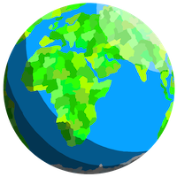
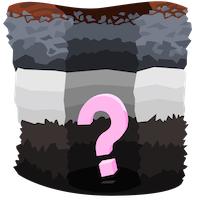

# CryptoMiner World
ERC721 based decentralized game

## Abstract
Lunched in late 2017, [Awesome CryptoKitties](https://github.com/cryptocopycats/awesome-cryptokitties)
opened a new era of [ERC721](http://erc721.org/) based decentralized games.
Being a pioneer, they didn't have to make their decentralized
game architecture perfect, they have left this issue to their followers.

[CryptoMiner World](https://cryptominerworld.com/) is one of these followers.
We've raised questions and problems left by our predecessors and designed the solutions to address these issues:
* Immutability vs upgradability in ERC721 based decentralized games
* Flexible and powerful access control
* Gas cost optimizations, transaction load reduction by leveraging off-chain capabilities

## Game Overview
_"Dig down, Level up, Trade in, Cash out"_

A step-by-step walkthrough of CryptoMiner World:

### The Basics

#### Buy a Plot of Land
Pick any location on the Earth to call your own.  

#### Select a Gemstone
One of your Gems can be assigned to each land plot you own.  

#### Sit Back and Relax
Gemstones love the earth so much, they eat it up.
Your assigned Gems will automatically dig through plots of land while you're away.  

#### Collect Your Loot
As time passes, your Gems will dig deeper and deeper, uncovering more and more treasure for you.    
Check up on them every day, week, month or whenever's convenient to see what's been found.  

#### Sell Your Loot
If you find something exciting, the best place to sell it is at the market.
Trade your valuables for Ether or just stop by to see what other people have dug up.  

### Digging Deeper
#### Layers of Land
Each plot of land is made up of 5 different tiers of terrain.
While every tier has the possibility to hold great treasure, the deeper you go, the more the possibilities increase.  

#### Growing Up
Baby Gems have a hard time eating anything but dirt.
As you level up their age, they’ll be able to handle the harder stuff.
Want to dig through obsidian? Get a Gem to a full grown adult and they’ll be able to handle anything.  
_Silver_ ore is used to increase your Gem's age. Find it while digging or from other players in the market.  

#### Speed King
Every Gem is born with a random grade. Higher grades can mine much faster.  
_Gold_ ore is used to increase your Gem's grade. Find it while digging or from other players in the market.  

### The Good Stuff
#### The Bottom
You did it, you made it through an entire plot of land. You should be rewarded for your efforts.
Collect your bonus loot. Maybe you’ll discover another gemstone, or a special artifact that grants additional powers,
or even a real life physical prize that can be mailed out to your actual home address. So many possibilities!  
If you’re really lucky, you might even find a rare key.  

#### Are You the Keymaster?
Keys are special in the world of CryptoMiner. Each one has the possibility to open a Monthly Chest or even the World Chest.  

#### Gemstone Chests
20% of all Plot of Land sales will go back to the players in the form of Gemstone Chests.
Along with Land sales, 1% of everything sold on the Market will go into the Gemstone Chests as well.
Once 10 ETH is accumulated a Gemstone Chest is released and a Key can open it.  

#### The Magical, Once in a Lifetime, Super Special, Ether World Chest
The title needs work, but there’s so much Ether in this chest, it deserves being so long.
Let's go with, World Chest. Once all Plots of Land have been purchased, this World Chest will be opened by one lucky Key holder.  

## Architecture Overview
// TODO

## Compile, Deploy and Run
// TODO
