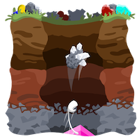

# CryptoMiner World
ERC721 based decentralized game by [Sophophilia Studios](https://sophophilia.com/)

## Abstract
Lunched in late 2017, [Awesome CryptoKitties](https://github.com/cryptocopycats/awesome-cryptokitties)
opened a new era of [ERC721](http://erc721.org/) based decentralized games.
Being a pioneer, they didn't have to make their decentralized
game architecture perfect, they have left this issue to their followers.

[CryptoMiner World](https://cryptominerworld.com/) is one of these followers.
We've raised questions and problems left by our predecessors and designed the solutions to address these issues:
* Immutability vs upgradability in ERC721 based decentralized games
* Flexible and powerful access control
* Gas cost optimizations, transaction load reduction by leveraging off-chain capabilities

## Game Overview
_"Dig down, Level up, Trade in, Cash out"_

A step-by-step walkthrough of CryptoMiner World:

### The Basics

#### Buy a Plot of Land
Pick any location on the Earth to call your own.  


#### Select a Gemstone
One of your Gems can be assigned to each land plot you own.  


#### Sit Back and Relax
Gemstones love the earth so much, they eat it up.
Your assigned Gems will automatically dig through plots of land while you're away.  


#### Collect Your Loot
As time passes, your Gems will dig deeper and deeper, uncovering more and more treasure for you.    
Check up on them every day, week, month or whenever's convenient to see what's been found.  


#### Sell Your Loot
If you find something exciting, the best place to sell it is at the market.
Trade your valuables for Ether or just stop by to see what other people have dug up.  


### Digging Deeper
#### Layers of Land
Each plot of land is made up of 5 different tiers of terrain.
While every tier has the possibility to hold great treasure, the deeper you go, the more the possibilities increase.  


#### Growing Up
Baby Gems have a hard time eating anything but dirt.
As you level up their age, they’ll be able to handle the harder stuff.
Want to dig through obsidian? Get a Gem to a full grown adult and they’ll be able to handle anything.  
_Silver_ ore is used to increase your Gem's age. Find it while digging or from other players in the market.  


#### Speed King
Every Gem is born with a random grade. Higher grades can mine much faster.  
_Gold_ ore is used to increase your Gem's grade. Find it while digging or from other players in the market.  


### The Good Stuff
#### The Bottom
You did it, you made it through an entire plot of land. You should be rewarded for your efforts.
Collect your bonus loot. Maybe you’ll discover another gemstone, or a special artifact that grants additional powers,
or even a real life physical prize that can be mailed out to your actual home address. So many possibilities!  
If you’re really lucky, you might even find a rare key.  


#### Are You the Keymaster?
Keys are special in the world of CryptoMiner. Each one has the possibility to open a Monthly Chest or even the World Chest.  


#### Gemstone Chests
20% of all Plot of Land sales will go back to the players in the form of Gemstone Chests.
Along with Land sales, 1% of everything sold on the Market will go into the Gemstone Chests as well.
Once 10 ETH is accumulated a Gemstone Chest is released and a Key can open it.  


#### The Magical, Once in a Lifetime, Super Special, Ether World Chest
The title needs work, but there’s so much Ether in this chest, it deserves being so long.
Let's go with, World Chest. Once all Plots of Land have been purchased, this World Chest will be opened by one lucky Key holder.  


## Architecture Overview
// TODO

## Compile, Deploy and Run
The project was developed and tested on Mac OSX 10.14.6

### Prerequisites
1. [Git](https://git-scm.com/) to download the source code
2. [Node.js](https://nodejs.org/) and [npm](https://www.npmjs.com/get-npm) to run truffle (see below)
3. [Truffle](https://www.trufflesuite.com/truffle) to compile and deploy smart contracts into test and main networks
4. [Ganache](https://www.trufflesuite.com/ganache) to run smart contract tests locally

### Compile
1. Get the source code:  
```git clone git@github.com:vgorin/crypto-miner.git```  

2. Install project dependencies  
```npm install```

3. Create an empty ```keys.js``` file:  
```touch keys.js```

4. Compile:  
```truffle compile```

### Running Tests Locally

1. Run tests  
```./test.sh```


### Examples:
#### Getting the Code
```
BBOOK-PRO:tmp vgorin$ git clone git@github.com:vgorin/crypto-miner.git
Cloning into 'crypto-miner'...
Enter passphrase for key '/Users/vgorin/.ssh/id_rsa':
remote: Enumerating objects: 728, done.
remote: Counting objects: 100% (728/728), done.
remote: Compressing objects: 100% (342/342), done.
remote: Total 6189 (delta 533), reused 556 (delta 386), pack-reused 5461
Receiving objects: 100% (6189/6189), 20.82 MiB | 6.92 MiB/s, done.
Resolving deltas: 100% (4643/4643), done.
```
#### Installing Dependencies
```
BBOOK-PRO:tmp vgorin$ cd crypto-miner/
BBOOK-PRO:crypto-miner vgorin$ npm install

> scrypt@6.0.3 preinstall /private/tmp/crypto-miner/node_modules/scrypt
> node node-scrypt-preinstall.js


> scrypt@6.0.3 install /private/tmp/crypto-miner/node_modules/scrypt
> node-gyp rebuild

  SOLINK_MODULE(target) Release/copied_files.node
  CC(target) Release/obj.target/scrypt_wrapper/src/util/memlimit.o
  CC(target) Release/obj.target/scrypt_wrapper/src/scryptwrapper/keyderivation.o
  CC(target) Release/obj.target/scrypt_wrapper/src/scryptwrapper/pickparams.o
  CC(target) Release/obj.target/scrypt_wrapper/src/scryptwrapper/hash.o
  LIBTOOL-STATIC Release/scrypt_wrapper.a
  CC(target) Release/obj.target/scrypt_lib/scrypt/scrypt-1.2.0/lib/crypto/crypto_scrypt.o
  CC(target) Release/obj.target/scrypt_lib/scrypt/scrypt-1.2.0/lib/crypto/crypto_scrypt_smix.o
  CC(target) Release/obj.target/scrypt_lib/scrypt/scrypt-1.2.0/libcperciva/util/warnp.o
  CC(target) Release/obj.target/scrypt_lib/scrypt/scrypt-1.2.0/libcperciva/alg/sha256.o
  CC(target) Release/obj.target/scrypt_lib/scrypt/scrypt-1.2.0/libcperciva/util/insecure_memzero.o
  CC(target) Release/obj.target/scrypt_lib/scrypt/scrypt-1.2.0/lib/scryptenc/scryptenc_cpuperf.o
  LIBTOOL-STATIC Release/scrypt_lib.a
  CXX(target) Release/obj.target/scrypt/src/node-boilerplate/scrypt_common.o
  CXX(target) Release/obj.target/scrypt/src/node-boilerplate/scrypt_params_async.o
  CXX(target) Release/obj.target/scrypt/src/node-boilerplate/scrypt_params_sync.o
  CXX(target) Release/obj.target/scrypt/src/node-boilerplate/scrypt_kdf_async.o
  CXX(target) Release/obj.target/scrypt/src/node-boilerplate/scrypt_kdf_sync.o
  CXX(target) Release/obj.target/scrypt/src/node-boilerplate/scrypt_kdf-verify_sync.o
  CXX(target) Release/obj.target/scrypt/src/node-boilerplate/scrypt_kdf-verify_async.o
  CXX(target) Release/obj.target/scrypt/src/node-boilerplate/scrypt_hash_sync.o
  CXX(target) Release/obj.target/scrypt/src/node-boilerplate/scrypt_hash_async.o
  CXX(target) Release/obj.target/scrypt/scrypt_node.o
  SOLINK_MODULE(target) Release/scrypt.node

> sha3@1.2.3 install /private/tmp/crypto-miner/node_modules/sha3
> node-gyp rebuild

  CXX(target) Release/obj.target/sha3/src/addon.o
  CXX(target) Release/obj.target/sha3/src/displayIntermediateValues.o
  CXX(target) Release/obj.target/sha3/src/KeccakF-1600-reference.o
  CXX(target) Release/obj.target/sha3/src/KeccakNISTInterface.o
  CXX(target) Release/obj.target/sha3/src/KeccakSponge.o
  SOLINK_MODULE(target) Release/sha3.node

> websocket@git://github.com/frozeman/WebSocket-Node.git#6c72925e3f8aaaea8dc8450f97627e85263999f2 install /private/tmp/crypto-miner/node_modules/web3-providers-ws/node_modules/websocket
> (node-gyp rebuild 2> builderror.log) || (exit 0)

  CXX(target) Release/obj.target/bufferutil/src/bufferutil.o
  SOLINK_MODULE(target) Release/bufferutil.node
  CXX(target) Release/obj.target/validation/src/validation.o
  SOLINK_MODULE(target) Release/validation.node

> websocket@1.0.28 install /private/tmp/crypto-miner/node_modules/websocket
> (node-gyp rebuild 2> builderror.log) || (exit 0)

  CXX(target) Release/obj.target/bufferutil/src/bufferutil.o
  SOLINK_MODULE(target) Release/bufferutil.node
  CXX(target) Release/obj.target/validation/src/validation.o
  SOLINK_MODULE(target) Release/validation.node
added 448 packages from 282 contributors and audited 115618 packages in 21.932s
found 0 vulnerabilities

```
#### Compiling
```
BBOOK-PRO:crypto-miner vgorin$ touch keys.js
BBOOK-PRO:crypto-miner vgorin$ truffle compile

Compiling your contracts...
===========================
> Compiling ./contracts/AccessControl.sol
> Compiling ./contracts/AccessMultiSig.sol
> Compiling ./contracts/AddressUtils.sol
> Compiling ./contracts/ArtifactERC20.sol
> Compiling ./contracts/BalanceProxy.sol
> Compiling ./contracts/ChestFactory.sol
> Compiling ./contracts/ChestKeyERC20.sol
> Compiling ./contracts/CountryERC721.sol
> Compiling ./contracts/DutchAuction.sol
> Compiling ./contracts/ERC165.sol
> Compiling ./contracts/ERC20Receiver.sol
> Compiling ./contracts/ERC721Core.sol
> Compiling ./contracts/ERC721Interfaces.sol
> Compiling ./contracts/ERC721Receiver.sol
> Compiling ./contracts/FoundersKeyERC20.sol
> Compiling ./contracts/FoundersPlotsMock.sol
> Compiling ./contracts/Fractions8.sol
> Compiling ./contracts/GemERC721.sol
> Compiling ./contracts/GoldERC20.sol
> Compiling ./contracts/Migrations.sol
> Compiling ./contracts/Miner.sol
> Compiling ./contracts/MintHelper.sol
> Compiling ./contracts/PlotAntarctica.sol
> Compiling ./contracts/PlotERC721.sol
> Compiling ./contracts/PlotSale.sol
> Compiling ./contracts/Random.sol
> Compiling ./contracts/RefPointsTracker.sol
> Compiling ./contracts/SilverERC20.sol
> Compiling ./contracts/SilverSale.sol
> Compiling ./contracts/StringUtils.sol
> Compiling ./contracts/TierMath.sol
> Compiling ./contracts/TimeUtils.sol
> Compiling ./contracts/TokenHelper.sol
> Compiling ./contracts/TokenReader.sol
> Compiling ./contracts/TokenWriter.sol
> Compiling ./contracts/Workshop.sol
> Compiling ./contracts/__ChestFactory.sol
> Compiling ./contracts/__DummyReceiver.sol
> Compiling ./contracts/__GemERC721.sol
> Compiling ./contracts/__Miner.sol
> Compiling ./contracts/__NowProvider.sol
> Artifacts written to /private/tmp/crypto-miner/build/contracts
> Compiled successfully using:
   - solc: 0.5.8+commit.23d335f2.Emscripten.clang

```

#### Running the Tests
```
BBOOK-PRO:crypto-miner vgorin$ ./test.sh

Compiling your contracts...
===========================
> Compiling ./contracts/AccessControl.sol
> Compiling ./contracts/AccessMultiSig.sol
> Compiling ./contracts/AddressUtils.sol
> Compiling ./contracts/ArtifactERC20.sol
> Compiling ./contracts/BalanceProxy.sol
> Compiling ./contracts/ChestFactory.sol
> Compiling ./contracts/ChestKeyERC20.sol
> Compiling ./contracts/CountryERC721.sol
> Compiling ./contracts/DutchAuction.sol
> Compiling ./contracts/ERC165.sol
> Compiling ./contracts/ERC20Receiver.sol
> Compiling ./contracts/ERC721Core.sol
> Compiling ./contracts/ERC721Interfaces.sol
> Compiling ./contracts/ERC721Receiver.sol
> Compiling ./contracts/FoundersKeyERC20.sol
> Compiling ./contracts/FoundersPlotsMock.sol
> Compiling ./contracts/Fractions8.sol
> Compiling ./contracts/GemERC721.sol
> Compiling ./contracts/GoldERC20.sol
> Compiling ./contracts/Migrations.sol
> Compiling ./contracts/Miner.sol
> Compiling ./contracts/MintHelper.sol
> Compiling ./contracts/PlotAntarctica.sol
> Compiling ./contracts/PlotERC721.sol
> Compiling ./contracts/PlotSale.sol
> Compiling ./contracts/Random.sol
> Compiling ./contracts/RefPointsTracker.sol
> Compiling ./contracts/SilverERC20.sol
> Compiling ./contracts/SilverSale.sol
> Compiling ./contracts/StringUtils.sol
> Compiling ./contracts/TierMath.sol
> Compiling ./contracts/TimeUtils.sol
> Compiling ./contracts/TokenHelper.sol
> Compiling ./contracts/TokenReader.sol
> Compiling ./contracts/TokenWriter.sol
> Compiling ./contracts/Workshop.sol
> Compiling ./contracts/__ChestFactory.sol
> Compiling ./contracts/__DummyReceiver.sol
> Compiling ./contracts/__GemERC721.sol
> Compiling ./contracts/__Miner.sol
> Compiling ./contracts/__NowProvider.sol
> Artifacts written to /var/folders/p6/khvkx49s6737rky0zyglsxdc0000gn/T/test-1191121-12900-fw9sxq.yw0f5
> Compiled successfully using:
   - solc: 0.5.8+commit.23d335f2.Emscripten.clang

[initial migration] test network - skipping the migration script
[July 8 deployment] test network - skipping the migration script


  Contract: TestRPC Config
	35 accounts:
	[0] 0x707c495D25aE1a4779Acaee31f31de832b658Ec3: 1000 ETH
	[1] 0xeeaC004Bc02b87891DD7Bbf58053B666e846AEA5: 1000 ETH
	[2] 0xc10f2650Aff3dF125F55aEb03161EeF3D97f3F66: 1000 ETH
	[3] 0x32D0a2D81E3569bcf56cFA9bD66f2B260dd04c6f: 1000 ETH
	[4] 0x9BaABF5B04F23ff9D19178f64B194539c105958D: 1000 ETH
	[5] 0xC157b488305a8023Fd469879796B6d13fbC75886: 1000 ETH
	[6] 0x5792E87DAb29C2251A40B138686d6E1b9E397530: 1000 ETH
	[7] 0xcc23BDAeedeb462348bD1680A7984404d986ED62: 1000 ETH
	[8] 0x23A663Bcc299AdcD5Da33a300d0c70C837d47557: 1000 ETH
	[9] 0x7A433FeA4D2184079D57F8670989ee90F28E36C1: 1000 ETH
	[10] 0x0d89dee8Fd07d6544decfCB42cA26aCD20845Bd8: 1000 ETH
	[11] 0xAFdBa3f56DD24e64872c9b3cEAbDc6d2E323C153: 1000 ETH
	[12] 0x491cdae520A20208C31e69B11f2f7d37f302D0C6: 1000 ETH
	[13] 0xEB184467E57507A962d759d59aAe035d85Aa01C1: 1000 ETH
	[14] 0x78BA5472bbEF9bD91F9Aee831d5aD739BD5c2a5E: 1000 ETH
	[15] 0xAdc005a6ED3897c2b5681e8B19003DE36be3f567: 1000 ETH
	[16] 0xAA99bcfBBfF6Db8975Da9f3a741B255781d73460: 1000 ETH
	[17] 0xb97c7145785D9Ab0087eD01f9e40F610e69E0ac0: 1000 ETH
	[18] 0xB8Ac42C853D9b66b1ee2704C00a67e48f9E2B92a: 1000 ETH
	[19] 0xD06877fE5515002e8B9205C0565C0685b6C68B39: 1000 ETH
	[20] 0xcC7c1529f6e40e447151Ba2B35c1384126aD1466: 1000 ETH
	[21] 0x69E77Fb73376013Ab8d1bE3Fd6c16ba390c82194: 1000 ETH
	[22] 0x3cc4B073A8B5005Fa7B3aA4b4D02939E3F6Eb842: 1000 ETH
	[23] 0x9D179aa76ADF5e79Fbd6a6A80Ad7398296FBc044: 1000 ETH
	[24] 0xA2d309f18Ee92242E1765024fCa402268f2aB26B: 1000 ETH
	[25] 0x5c31031e92c80ccB9E75b8903445d3A3e8c9BA5f: 1000 ETH
	[26] 0xd2654092F37Ea6D6d939311e2D1456a9B0b6300c: 1000 ETH
	[27] 0xeBB4BaF4DF67eFB5a6169e84a1575390b03Ab172: 1000 ETH
	[28] 0x35a79385B306cBfe2903296b8D91DEB59707abAB: 1000 ETH
	[29] 0x6e2b737a61878e205df43E8c71df6a68d656e92b: 1000 ETH
	[30] 0x22eE1b1069cBd1a1f4cA35531F421469200d4d51: 1000 ETH
	[31] 0xA26012DCa7B334929B32049dd273931D8e981a23: 1000 ETH
	[32] 0xe3DFBbe8117881c79BFF5d298763929e7bdC3742: 1000 ETH
	[33] 0x87e39563237939fC38603D2A525a42C925448BD2: 1000 ETH
	[34] 0xA600f3688568a45F54709E1abdab5574b580Bf59: 1000 ETH
    ✓ account balances (206ms)

  Contract: Access Control MultiSig
    ✓ initial state: no features are enabled, only creator has full permissions (210ms)
    ✓ updating features: updating same twice is fine (279ms)
	['..............*.*..*..*...*...**.**.........*..*.*.**...*.**...........*..*...*....**.*...*..............*.*...**..*..*.*.......']
	['.*..*..*..*.....*...**.**.....*...*...........*......*.*.*....**....*.....**....*.....****.......**..***..*......***...*....*...']
    ✓ updating features: two ways to check enabled features are compliant (4849ms)
    ✓ updating features: add, remove, require feature manager (291ms)
    ✓ updating features: complex scenario (195ms)
    ✓ updating role: updating same twice is fine (166ms)
	['*..*..........*.......*.*....*.**..*..*..*.........**.........*...*...*.*.**.*........*...**.*..*....**...*...*.**......*..***..']
	['..*....*.*..*...*........*.....*...***...*.*.*......*....*...**.*..*........**.*........*.*..........*..**....**.**.**...*..*.*.']
    ✓ updating role: two ways to check enabled role are compliant (4404ms)
    ✓ updating role: add, remove role, require role manager (267ms)
    ✓ updating role: complex scenario (123ms)
    ✓ updating role: destroying the only admin (86ms)
    ✓ m-sig: once MSIG enabled regular calls fail (349ms)
    ✓ m-sig: creating a request (75ms)
    ✓ m-sig: sign and perform feature update request (1 signature + sender) (977ms)
    ✓ m-sig: sign and perform role update request (1 signature + sender) (1049ms)
    ✓ m-sig: sign and perform feature update request (2 signatures) (1870ms)
    ✓ m-sig: sign and perform role update request (2 signatures) (3015ms)
    ✓ m-sig: replay attack using 2 instances – Robert Magier scenario (401ms)

  Contract: Access Control
    ✓ initial state: no features are enabled, only creator has full permissions (129ms)
    ✓ updating features: add, remove, require feature manager (311ms)
    ✓ updating features: complex scenario (158ms)
    ✓ updating an operator: add, remove role, require role manager (321ms)
    ✓ updating an operator: complex scenario (146ms)
    ✓ updating an operator: destroying an operator (87ms)

  Contract: ChestFactory (NowProvider)
	registering 1 key(s) to open a chest gas usage: 127224
    ✓ winning a founders' chest - single participant with single key (1056ms)
	registering 50 key(s) to open a chest gas usage: 1380546
    ✓ winning a founders' chest - single participant with multiple keys (1106ms)
	registering 50 key(s) to open a chest gas usage: 1365546
	registering 100 key(s) to open a chest gas usage: 2614510
    ✓ winning a founders' chest - two participants (1315ms)
    - winning a chest - single participant with single key
    - winning a chest - single participant with multiple keys
    - winning a chest - two participants
    ✓ expired chest - no participants (505ms)

  Contract: ChestFactory
    ✓ deploying treasure chest factory (246ms)
    ✓ creating a chest requires ROLE_CHEST_MANAGER role (463ms)
    ✓ creating a chest, putting a key to unlock (440ms)
    ✓ creating a founder's and regular chests (1176ms)

  Contract: ChestKeyERC20
    ✓ deployment: initial token state (120ms)
    ✓ permissions: creator and destroyer are different permissions
    ✓ permissions: minting tokens requires ROLE_TOKEN_CREATOR permission (194ms)
    ✓ permissions: burning tokens requires ROLE_TOKEN_DESTROYER permission (197ms)
    ✓ permissions: transfers and transfers on behalf are different features
    ✓ permissions: transfers require FEATURE_TRANSFERS feature to be enabled (412ms)
    ✓ permissions: transfers on behalf require FEATURE_TRANSFERS_ON_BEHALF feature to be enabled (270ms)
    ✓ minting and burning: minting, burning, zero-value checks (404ms)
    ✓ minting: arithmetic overflow check (388ms)
    ✓ transfers: transferring tokens (420ms)
    ✓ transfers: transferring on behalf (436ms)
    ✓ transfers: safe and unsafe transfers (671ms)
    ✓ transfers: transfer arithmetic check (313ms)
    ✓ transfers: transfer on behalf arithmetic check (394ms)
    ✓ transfers: transfer / transfer on behalf zero value checks (219ms)

  Contract: CountryERC721
    ✓ config: total number of plots
    ✓ initial state: no tokens exist initially (516ms)
    ✓ mint: creating a token (704ms)
    ✓ mint: integrity of newly created token (541ms)
    ✓ mint: token map (403ms)
    ✓ taxes: check the tax rate is set correctly initially (404ms)
    ✓ taxes: update tax rate, maximum rate (538ms)
    ✓ integrity: create few tokens, check the integrity (847ms)
    ✓ ext256: write requires ROLE_EXT_WRITER permission (443ms)
	0x1a82e000d000c0000000000000a0001d99810170140086012000ce417d3819
    ✓ ext265: verify integrity of read/write operation (2322ms)
    ✓ unsafe transfer: transferring a token (816ms)
    ✓ unsafe transfer: transferring own token using transferFrom (816ms)
    ✓ safe transfer: transferring a token (1147ms)
    ✓ approvals: grant and revoke token approval (989ms)
    ✓ approvals: operator transfers approval and revokes (978ms)
    ✓ approvals: add and remove operator (411ms)
    ✓ approvals: operator in action (752ms)
    ✓ transfer on behalf: transferring a token (939ms)
    ✓ safe transfer on behalf: transferring a token (1357ms)

  Contract: CountrySale: Gas Usage
    ✓ gas: deploying a country requires 4,958,389 gas (328ms)
    ✓ gas: minting a country requires 165,560 gas (354ms)
    ✓ gas: transferring a country requires 72,017 gas (386ms)

  Contract: Dutch Auction
    ✓ auction: testing wrong parameters (1477ms)
    ✓ auction: putting up for sale – permissions (1165ms)
    ✓ auction: putting up for sale - approve() + addNow() (345ms)
    ✓ auction: putting up for sale - safeTransferFrom() (355ms)
    ✓ auction: putting up and removing from sale (408ms)
    ✓ auction: selling, buying, adding, removing - using safeTransferFrom() (419ms)
    ✓ auction: buyTo (407ms)
    ✓ auction: transaction fees (655ms)
    ✓ auction: selling two different ERC721 tokens (719ms)

  Contract: GemERC721
    ✓ initial state: initial zero values, supported interfaces (507ms)
    ✓ initial state: throwable functions (980ms)
    ✓ integrity: verify minted token data integrity (596ms)
    ✓ nextId: incNextId requires ROLE_NEXT_ID_PROVIDER permission (168ms)
    ✓ nextId: setNextId requires ROLE_NEXT_ID_PROVIDER permission (172ms)
    ✓ nextId: incNextId/setNextId arithmetic overflow checks (290ms)
    ✓ minting: minting a token requires ROLE_TOKEN_CREATOR role (180ms)
    ✓ minting: mintWith() requires ROLE_AGE_PROVIDER role if age is set (221ms)
    ✓ minting: mintNext() requires ROLE_NEXT_ID_PROVIDER role (221ms)
    ✓ minting: mint() constraints and function (298ms)
    ✓ minting: mintNext() increases nextId (251ms)
    ✓ leveling: levelUpTo() requires ROLE_LEVEL_PROVIDER role (216ms)
    ✓ leveling: levelUpTo() constraints and function (280ms)
    ✓ leveling: levelUpBy() requires ROLE_LEVEL_PROVIDER role (209ms)
    ✓ leveling: levelUpBy() constraints and function (242ms)
    ✓ upgrading: upgrade() requires ROLE_GRADE_PROVIDER role (216ms)
    ✓ upgrading: upgrade() constraints and function (305ms)
    ✓ mining stats: updateMinedStats() requires ROLE_MINED_STATS_PROVIDER role (209ms)
    ✓ mining stats: updateMinedStats() constraints and function (295ms)
    ✓ age: setAge() requires ROLE_AGE_PROVIDER role (224ms)
    ✓ age: setAge() constraints and function (181ms)
    ✓ state: changing token state requires ROLE_STATE_PROVIDER role (217ms)
    ✓ state: modify token state and check (243ms)
    ✓ transfer locking: modifying transfer lock requires ROLE_TRANSFER_LOCK_PROVIDER role (172ms)
    ✓ transfer locking: impossible to transfer locked token (383ms)
    ✓ transfer locking: change transfer lock and check (130ms)
    ✓ ext256: write requires ROLE_EXT_WRITER permission (169ms)
	0x1a00004004780800080001c41400000a0705eb580200100270c1e8bb53811
    ✓ ext265: verify integrity of read/write operation (2134ms)
    ✓ unsafe transfer: transferring a token (539ms)
    ✓ unsafe transfer: transferring own token using transferFrom (499ms)
    ✓ safe transfer: transferring a token (731ms)
    ✓ approvals: grant and revoke token approval (743ms)
    ✓ approvals: operator transfers approval and revokes (678ms)
    ✓ approvals: add and remove operator (206ms)
    ✓ approvals: operator in action (565ms)
    ✓ transfer on behalf: transferring a token (886ms)
    ✓ safe transfer on behalf: transferring a token (966ms)

  Contract: GemERC721: Gas Usage
    ✓ gas: deploying GemERC721 requires 4,930,414 gas (70ms)
    ✓ gas: minting a token requires 216,226 gas (134ms)
    ✓ gas: leveling up a gem requires 37,118 gas (153ms)
    ✓ gas: upgrading a gem requires 37,071 gas (148ms)
    ✓ gas: setting energetic age of a gem requires 37,068 gas (159ms)
    ✓ gas: updating gem state requires 37,016 gas (151ms)
    ✓ gas: transferring a token requires 75,696 gas (187ms)

  Contract: GoldERC20
    ✓ deployment: initial token state (118ms)
    ✓ permissions: creator and destroyer are different permissions
    ✓ permissions: minting tokens requires ROLE_TOKEN_CREATOR permission (159ms)
    ✓ permissions: burning tokens requires ROLE_TOKEN_DESTROYER permission (188ms)
    ✓ permissions: transfers and transfers on behalf are different features
    ✓ permissions: transfers require FEATURE_TRANSFERS feature to be enabled (408ms)
    ✓ permissions: transfers on behalf require FEATURE_TRANSFERS_ON_BEHALF feature to be enabled (273ms)
    ✓ minting and burning: minting, burning, zero-value checks (432ms)
    ✓ minting: arithmetic overflow check (438ms)
    ✓ transfers: transferring tokens (400ms)
    ✓ transfers: transferring on behalf (434ms)
    ✓ transfers: safe and unsafe transfers (654ms)
    ✓ transfers: transfer arithmetic check (300ms)
    ✓ transfers: transfer on behalf arithmetic check (378ms)
    ✓ transfers: transfer / transfer on behalf zero value checks (210ms)

  Contract: GoldERC20: Gas Usage
    ✓ gas: deploying GoldERC20 requires 1600062 gas (48ms)
    ✓ gas: minting some tokens requires 68429 gas (107ms)
    ✓ gas: burning some tokens requires 38664 gas (106ms)
    ✓ gas: transferring some tokens requires 52593 gas (147ms)
    ✓ gas: allowing transfers on behalf requires 45238 gas (72ms)
    ✓ gas: transferring on behalf requires 59474 gas (169ms)

  Contract: Miner
    ✓ deployment: verify deployment routine (706ms)
    ✓ integrity: plots, gems, collections, allTokens shifting - single account (2541ms)
    ✓ integrity: plots, gems, collections, allTokens shifting - 2 accounts (3576ms)
    ✓ colors: setGemColors requires ROLE_GEM_COLORS_PROVIDER permission (676ms)
    ✓ colors: verify integrity of set/get available colors operation (1301ms)
    ✓ mining rates: setting mining rates requires ROLE_SPECIAL_GEMS_PROVIDER permission (729ms)
    ✓ mining rates: verify integrity of set/get mining rate multiplier (906ms)
    ✓ mining rates: special country gems (829ms)
    ✓ mining rates: special country gems overflow check (605ms)
    ✓ mining: mining properties of the new gem(s) (1224ms)
    ✓ mining: binding gem to a plot (932ms)
    ✓ colors: verify random color getter (11274ms)

  Contract: Miner (NowProvider)
    ✓ mining: mining properties of the 25 min old gem(s) (1353ms)
    ✓ mining: mining with resting energy only (bind with and without locking) (2580ms)
    ✓ mining: evaluating plot offset (1127ms)
    ✓ mining: updating plot offset and releasing (2373ms)
    ✓ mining: mining 15 plots (25084ms)


```
